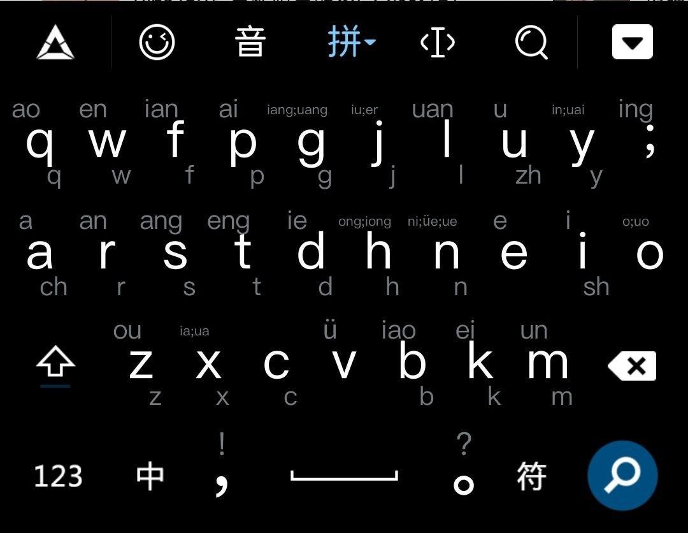

# Colemak Geek 紫光双拼 

fork自TsFreddie的 [BaiduIME-Skin-Colemak-Geek](https://github.com/TsFreddie/BaiduIME-Skin-Colemak-Geek) 皮肤 

_Colemak Geek_ is a customized layout for Baidu IME for Mobile (Android, iOS and Symbian) with Colemak layout and full symbols support.

**该皮肤布局仅适用于2.1及以上版本百度手机输入法，不适用于2.0版。**

## 下载 

* 从 release 下载.bds文件

## 安装方法:

### Android、Symbian

* 方法1：将下载的皮肤布局文件（.bds）拷贝到手机任意位置，使用手机文件浏览器，以“百度输入法”打开，系统自动安装（部分android手机不支持后缀关联.请使用以下两种方法）
* 方法2：将下载的皮肤布局文件（.bds）放到指定目录。 【Android目录】：`sdcard/baidu/ime/skins` 【S60 V5/Symbian^3目录】：`手机存储/baidu/input/touchskin`
  * 如果手机没有对应的目录， 可以先手动随便建立一个自己的自定义皮肤，百度输入法就会建立对应的路径了(`sdcard/baidu/ime/skins`)
* 新版本安卓目录在 `/sdcard/Android/data/com.baidu.input/files/ime/skins` 需要root权限才能复制

### iPhone

* 下载皮肤布局文件（.bdi文件或带苹果标志的.bds文件）
* 放入手机中对应文件夹 `/var/mobile/Library/Keyboard/BaiduInputMethod/layouts`
* Respring 手机

## 使用方法:

* Android：点击输入法面板上熊头logo，进入“超级皮肤”（3.1版以下为“主题/皮肤”），在皮肤布局页中，选择您要启用的皮肤布局。
* S60 v5/Symbian^3：点击输入法面板上熊头logo，进入“主题/皮肤”，在皮肤页中，选择您要启用的皮肤布局。 iPhone：进入输入法设置项，进入超级皮肤 ，在布局页中选择您要启用的皮肤布局。

* 启用皮肤后， 需要开启百度输入法的紫光双拼 
  * 输入法设置 - 高级设置 - 启用双拼 开启 , 管理双拼方案 26键双拼方案 - 紫光双拼

# 功能介绍
* 26拼音下的英文上下数字符号变成双拼声母韵母

# demo

# 生成bds 文件的方法 
* 使用 taskfile 工具 
* linux : go-task

* 或手动在 bds_source 文件夹运行 `zip -r Colemak.xtcc.bds ./*`